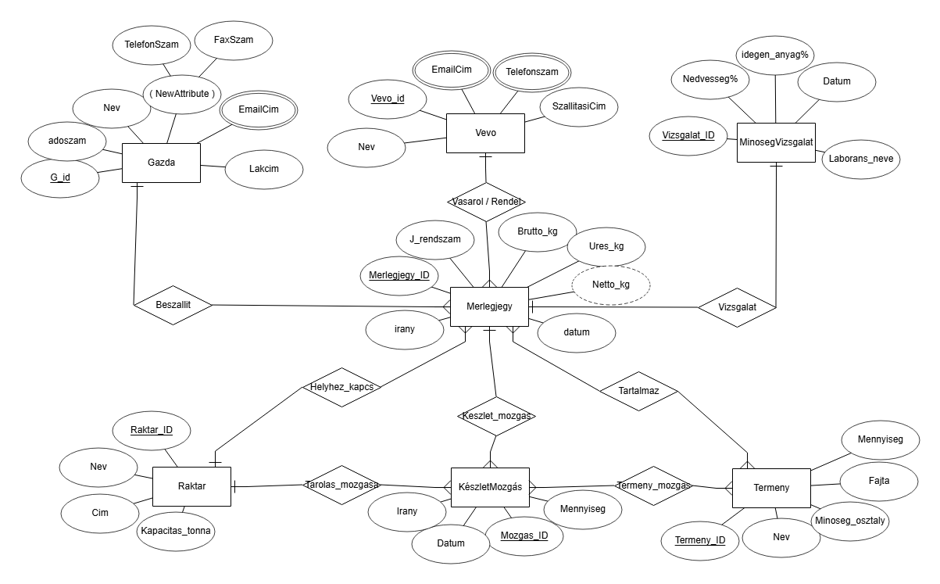
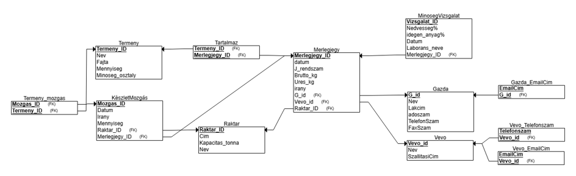

# Relációs adatbázis tervezés — Mezőgazdasági terménykereskedő rendszer

Az Adatbázis 1 tantárgy féléves beadandója. A feladat az volt, hogy találjunk ki egy saját adatbázist, csináljuk meg az ER-sémáját, konvertáljuk relációs modellé, és végül implementáljuk SQLite-ban.

Én egy mezőgazdasági termékekkel foglalkozó cég kisebb modelljét csináltam meg.

## A modellezett rendszer

A rendszerben gazdák termelik a terményt, amit a cég felvásárol, raktároz és vevőknek értékesít. Minden be- és kiszállítást egy mérlegjegy rögzít, a raktárak közötti mozgásokat készletmozgás követi, a beérkező árut pedig minőségvizsgálat ellenőrzi.

Táblák:

- `Gazda`, `Vevo` — a beszállítók és a vásárlók
- `Merlegjegy` — minden be-/kiszállítás adata
- `Raktar` — tárolóhelyek
- `Termeny` — a kereskedett terményfajták
- `MinosegVizsgalat` — a beérkező terményeken végzett vizsgálatok
- `KeszletMozgas` — raktári mozgások

Az adatbázisban van egy-több és több-több kapcsolat is, elsődleges és idegen kulcsok, összetett és többértékű adattagok.

## ER-modell



## Relációs modell



## Normalizálási döntések

**1NF** — Az email-címek és telefonszámok külön táblába kerültek, mert ha simán a Gazda/Vevő táblában hagyjuk őket, nem lehet megkülönböztetni az egy személyhez tartozó több értéket.

**2NF** — Az adatbázis tartalmaz több-több kapcsolatokat, ezeket kapcsolótáblák oldják fel (`Tartalmaz`, `Termeny_mozgas`) összetett primary key-jel.

**3NF** — A raktár neve nem szerepel közvetlenül a `Merlegjegy` táblában. Idegen kulcson keresztül, JOIN-nal érjük el a `Raktar` táblából — így nem duplikálódnak az adatok.

## Fájlok

| Fájl | Tartalom |
|---|---|
| `schema.sql` | A táblák létrehozása (`CREATE TABLE`) |
| `data.sql` | Minta adatok feltöltése (`INSERT`) |
| `queries.sql` | Tábla-módosítások és lekérdezések (~25 db) |
| `ER_modell.png` | Az ER-diagram |
| `Relation_modell.png` | A relációs modell diagramja |

## Használat

```bash
sqlite3 adatbazis.db
sqlite> .read schema.sql
sqlite> .read data.sql
sqlite> .read queries.sql
```

## Technológia

SQLite